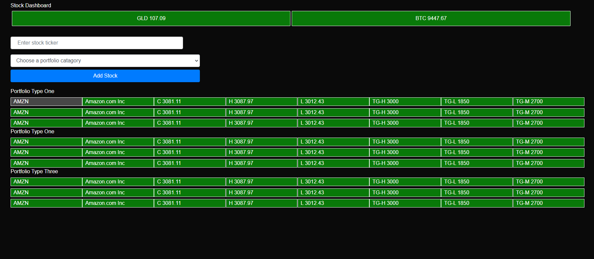

# Stock Portfolio Tracker 

## Description 
This app will allow the user to create a stock portfolio which tracks their stocks of interest
## Table of Contents 
* [Concepts](#Concepts)
* [Deployment](#Deployment)
* [Screenshot](#Screenshot)
## Concepts  
* Model-View-Controller (MVC)
* Object Relational Mapping (ORM)
* Express.js
* HTTP Requests (GET, POST,PUT,DELETE)
* Routes and static content
* Handlebars engine integration
* Node.js
* Backend API calls
* Handlebars Templates and Layouts
* MySQL
## Deployment 
The Stock Portfolio Tracker is deployed on heroku here: 

## Screenshot

